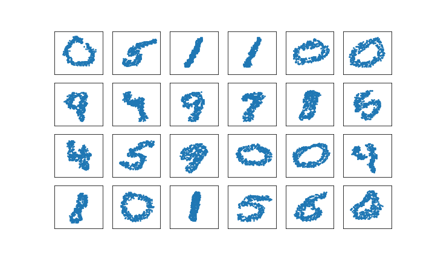
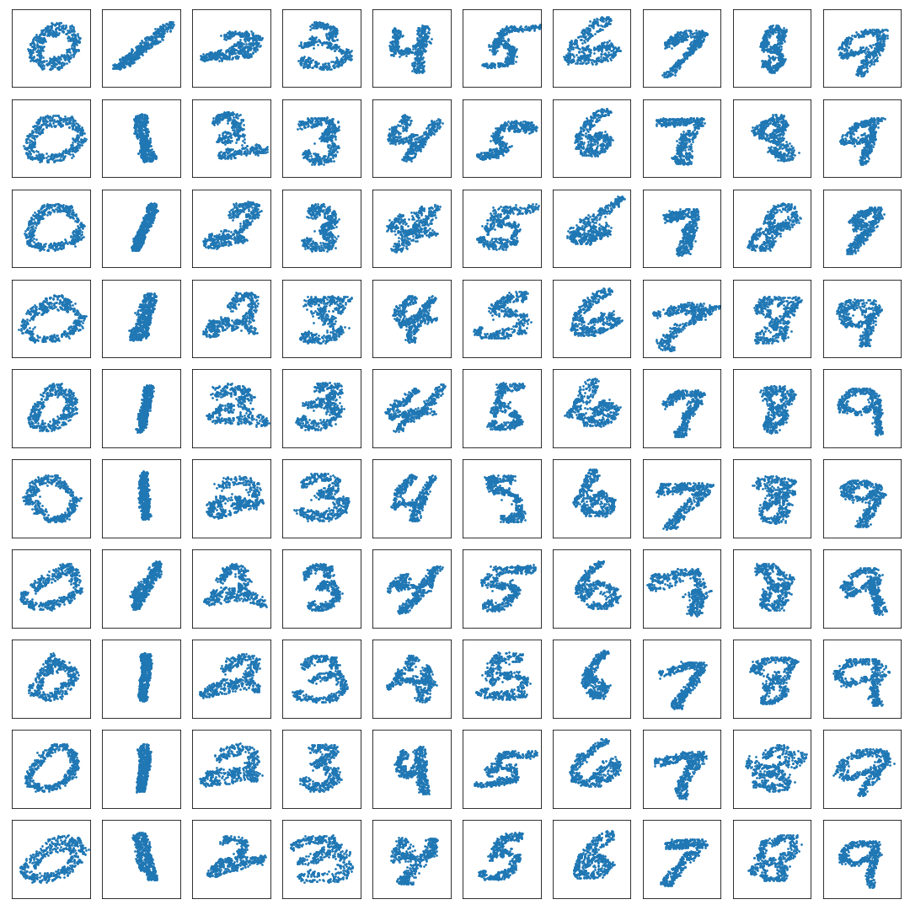

# Generative Adversarial Set Transformers

This repository is an unofficial Tensorflow/Keras implementation of the *Generative Adversarial Set Transformer* framework from the paper: https://www.ml.informatik.tu-darmstadt.de/papers/stelzner2020ood_gast.pdf.

## Dependencies

This repository depends on the implementation of [Set Transformers](https://arxiv.org/abs/1810.00825) found in the unofficial repository: https://github.com/DLii-Research/tf-set-transformer

## AC-GAST

This repository includes a notebook that implements an Auxiliary-Classifier GAN model using the GAST framework. The figure above are the result of running 27 epochs.
